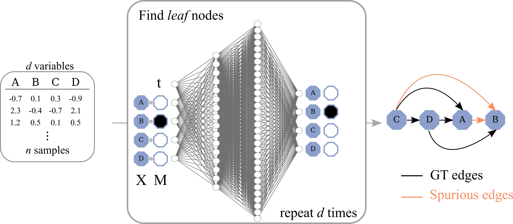

# DiffAN

Code for the paper "Diffusion Models for Causal Discovery via Topological Ordering".



## Running code

See example of how to use DiffAN class in `demo_DiffAN.py`. Once an instance diffan_obj of DiffAN is created, diffan_obj.fit() will 
- train the diffusion model, 
- run topological ordering and,
- perform pruning of spurious edges.

The output is the adjacency matrix of the causal graph.

## Hyperparameters

Most hyperaparameters are hard-coded into constructor of the DiffAN class and we verified they work across a wide set of datasets.

However, as decribed in the paper, there is an approximation of DiffAN referred to as "DiffAN Masking" that has better scaling laws while maintaining similar performance. Setting the `residue` to False in
```
diffan = DiffAN(n_nodes, residue = False)
```
will use the approximation.

## Install Requirements

The repo use python and R code. To install the python dependencies, run:

```
conda env create -f environment.yml
```

The most important python dependencies are `numpy`, `torch` and `functorch` which can be easily installed manually if one prefer not to use conda. `cdt` is needed for using the R pruning code.
If the R dependencies are not installed, some of the pruning functions won't work. In this case, we advise to open an R session and install the specific packages from R directly.

